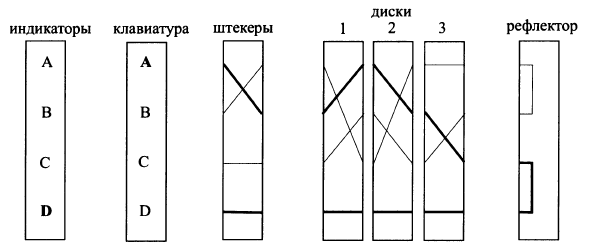
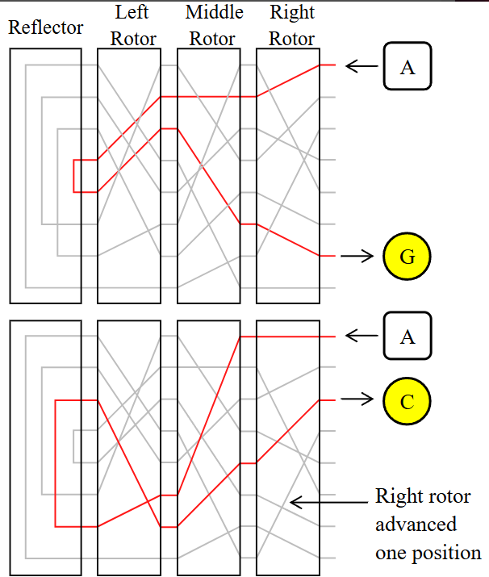
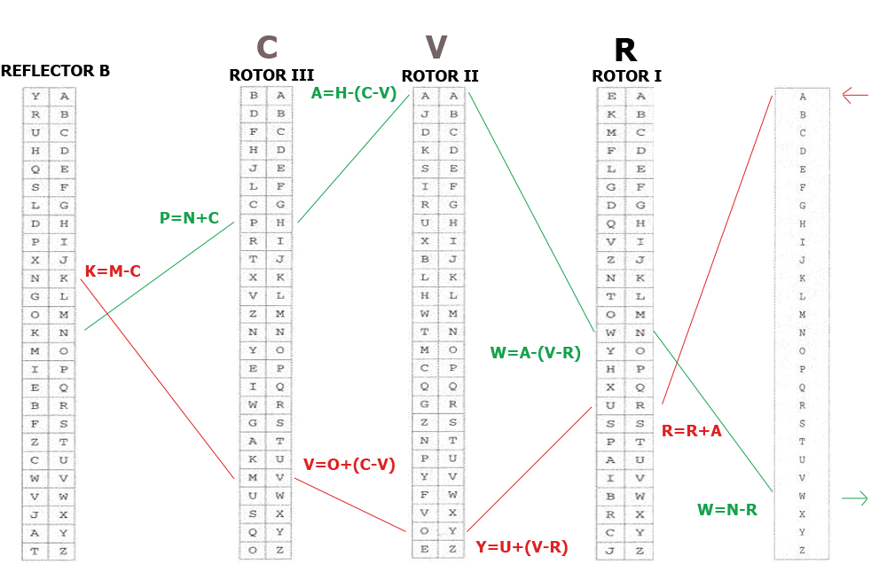

## ЛРІ.І Реализация электронного аналога шифровальною машины «Энигма».
**Цель работы:** Разработка электронного аналога шифровальной машины.Шифрование и расшифровка произвольного файла. 

**Задание:** Реализовать виде программы электронный аналог шифровальной машины «Энигма». Обеспечить шифрование и расшифровку произвольного файла с использованием разработанной программы. Предусмотреть работу программы с пустым, однобайтовым файлом.

#### Вопросы для защиты работы.
1. Дайте определения следующих терминов: информация, защита информации, актив, информационная сфера, угроза, шифровальная машина «Энигма»
2. Дайте определение одно-и многоалфавитных подстановок.
3. К какому виду относится алгоритм Энигма
4. Привести схему алгоритма Энигма.

# Энигма

- коммутационная панель (Штекеры (Steckerbrett): Коммутационная панель для попарной замены букв.)
- N роторов
- рефлектор
- - не вращается
- - соединяет попарно контакты
- - наличие рефлектора делало процессы шифрования и дешифрования идентичными.
- - невозможности шифрования какой-либо буквы в саму себя. ????

В настоящей Энигме каждый диск имел специальную выемку, которая в определенной позиции подцепляла следующий ротор и сдвигала его на одну позицию. Расположение выемки для каждого из роторов можно было регулировать с помощью специальных внешних колец. 

##### 1
1. Информация — это сведения (сообщения, данные) независимо от формы их представления, воспринимаемые человеком или специальными устройствами как отражение фактов материального или духовного мира в процессе коммуникации.

2. Защита информации — это комплекс мероприятий, направленных на обеспечение конфиденциальности (недоступности информации для неавторизованных лиц), целостности (точности и полноты информации) и доступности (возможности получить информацию авторизованным пользователям) информации. Это процесс противодействия угрозам безопасности информации.

3. Актив (в контексте информационной безопасности) — это любой компонент информационной системы (данные, оборудование, программное обеспечение, персонал, услуги, репутация), который имеет ценность для организации и поэтому требует защиты.

4. Информационная сфера — это совокупность информации, информационной инфраструктуры, субъектов, осуществляющих сбор, формирование, распространение и использование информации, а также системы регулирования возникающих при этом общественных отношений. Это среда, в которой существует и циркулирует информация.

5. Угроза (безопасности информации) — это потенциальная возможность того, что определенное лицо, действие, событие или явление (источник угрозы) преднамеренно или случайно нарушит безопасность информации (ее конфиденциальность, целостность, доступность), нанеся ущерб владельцу или пользователю информации.

6. Шифровальная машина «Энигма» — это портативная электромеханическая шифровальная машина, использовавшаяся в XX веке (в основном нацистской Германией во Второй мировой войне) для защиты служебной переписки. Ее основным принципом работы было многоалфавитное шифрование с изменяющимся алфавитом замены после каждой буквы, реализуемое с помощью системы вращающихся роторов.

##### 2
Одноалфавитная подстановка — подстановка, при которой каждый символ открытого текста заменяется на один и тот же символ шифрованного текста на протяжении всего сообщения.

Многоалфавитная подстановка —подстановка, при которой каждый символ открытого текста может заменяться на разные символы шифрованного текста в зависимости от своей позиции в тексте и используемого алфавита замены.

##### 3
Алгоритм Энигма относится к многоалфавитным подстановочным шифрам.

